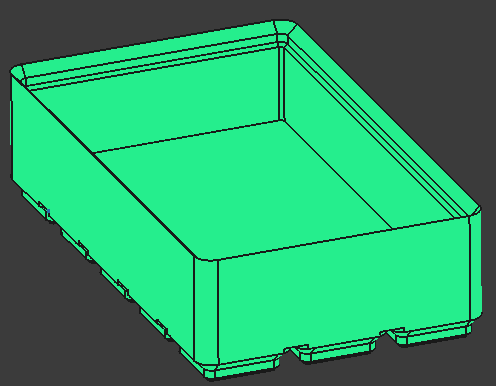
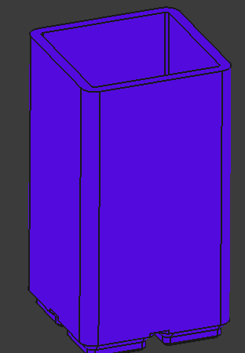

# dvng_gridfinity

Based on [Gridfinity | The modular, open-source grid storage system](https://www.youtube.com/watch?v=ra_9zU-mnl8), by [Zack Freedman's](https://www.youtube.com/@ZackFreedman).
As it is an open design I belive it shall be possible to use only open tools for its development.
Check [the gridfinity official especification](https://gridfinity.xyz/specification/) to know more about the design.
My implementation may not be strictly compliant with it, so be careful integrating it with your own or 3rd party designs, they may not work.

There is a bibliography at the botton with any model I used as inspiration.

All models are parametrizable through the `user_input` variable set.
Depending on the file there may be different parameters available.
In most of them there is one for managing the grid and height.

## [Baseplate](./mec/baseplate.FCStd)

| 5x2 no filling corner | 4x3 filling corner |
| - | - |
|  |  |

In addition to the basic baseplates there are some other custom baseplates, in this case, each design is a unique file.

| 3x3 single chamfer | 7x4 tiered | 5x7 slanted | 5x7 clipable | L-shaped |
| - | - | - | - | - |
|  |  |  |  |  |

## [Container](./mec/container.FCStd)

| 5x3x3 stackable | 2x2x10 non-stackable |
| - | - |	
|  |  |

In addition to the basic container there are some other custom ones, in this case, each design is a unique file.

| 5x2 slanted base | 4x3 slanted lip | 5x7 clickable |
| - | - | - |
|  |  |  |

And purpouse specific containers.

| 4x3 slanted base | 4x3 slanted lip | 5x7 clickable |
| - | - | - |
|  |  |  |

## [Miscellaneous](./mec/misc.FCStd)

This is a list of 3d models that are neither baseplater nor containers.

| spacer 5x2x3 | lid 3x4 | lid stackable 7x3 |
| - | - | - |
|  |  |  |

---

## Bibliography
* [Gridfiniry sepcs](https://gridfinity.xyz/)
* [Clip-on Gridfinity Baseplate and Bin](https://www.printables.com/model/368313-clip-on-gridfinity-baseplate-and-bin)
* [Gridfinity Angled baseplates](https://www.printables.com/model/656549-gridfinity-angled-baseplates)
* [Gridfinity | Tiered Baseplate | Parametric](https://www.printables.com/model/554733-gridfinity-tiered-baseplate-parametric)
* [Polyonimo](https://en.wikipedia.org/wiki/Polyomino)

---

Davang -