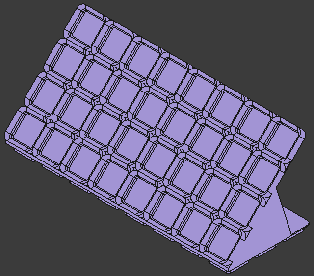
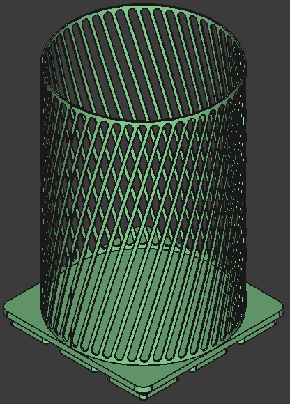
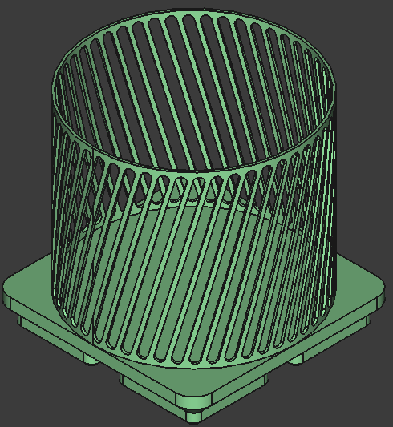

# dvng_gridfinity

Based on [Gridfinity | The modular, open-source grid storage system](https://www.youtube.com/watch?v=ra_9zU-mnl8), by [Zack Freedman's](https://www.youtube.com/@ZackFreedman).
As it is an open design I belive it shall be possible to use only open tools for its development.
Check [the gridfinity official especification](https://gridfinity.xyz/specification/) to know more about the design.
My implementation may not be strictly compliant with it, so be careful integrating it with your own or 3rd party designs, they may not work.

All models are parametrizable through the `user_input` variable set, there shall be one per file.
Depending on the file there may be different parameters to configure.
One goal of this project is that all models can be easily configured for your own needs.
I do not achive to have a fully parametrizable project, but one that is flexible enough to adapt up to certain level.

All model are within the [mec](./mec/) directory, within it, three folders: [baseplate](./mec/baseplate), [container](./mec/container) and [misc](./mec/misc).
Each folder has a base file with the basic designs.
Each custom design is placed in a different file.
The miscellaneous directory has gridfinity compatible desgins that are neither baseplates or containers.

I decided to go with [FreeCAD](https://www.freecad.org/index.php) as I like it and it is pretty easy to use if you are familiar with other 3D parametric software.
Unlike OpenScad or other gridfinity generators the main target of this project is to have 3d models of the designs.
Although I apprecieate the work of the generators and those projects based on OpenScad, for me they feel like coding.
If I am doing 3d modeling, I do not want to write code.

## [Baseplate](./mec/baseplate/)

| 5x2 no filling corner | 4x3 filling corner | 3x3 single chamfer |
| - | - | - |
|  |  |  |

| 7x4 tiered | 5x7 slanted | 1x1 clipable |
| - | - | - |
|  |  |  |

## [Container](./mec/container/)

| 5x3x3 stackable | 2x2x10 non-stackable | 5x5x4 non-stackable |
| - | - | - |
|  |  |  |

| 5x2 slanted base | 4x3 slanted lip | 5x7 clickable |
| - | - | - |
|  |  |  |

| vernier calliper | SD cards | tall pen cup | shallow pen cup |
| - | - | - | - |
|  |  |  |  |

## [Miscellaneous](./mec/misc/)

| spacer 5x2x3 | lid 3x4 | lid stackable 7x3 |
| - | - | - |
|  |  |  |

---

## Bibliography
* [Gridfiniry sepcs](https://gridfinity.xyz/)
* [Clip-on Gridfinity Baseplate and Bin](https://www.printables.com/model/368313-clip-on-gridfinity-baseplate-and-bin)
* [Gridfinity Angled baseplates](https://www.printables.com/model/656549-gridfinity-angled-baseplates)
* [Gridfinity | Tiered Baseplate | Parametric](https://www.printables.com/model/554733-gridfinity-tiered-baseplate-parametric)
* [Polyonimo](https://en.wikipedia.org/wiki/Polyomino)

---

Davang -