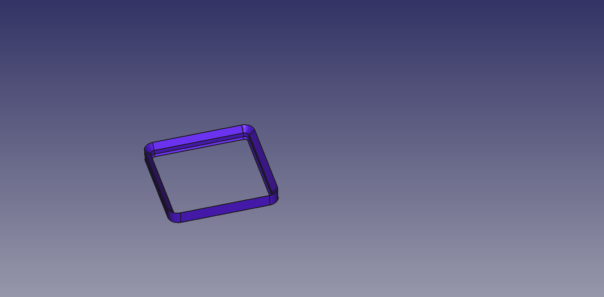
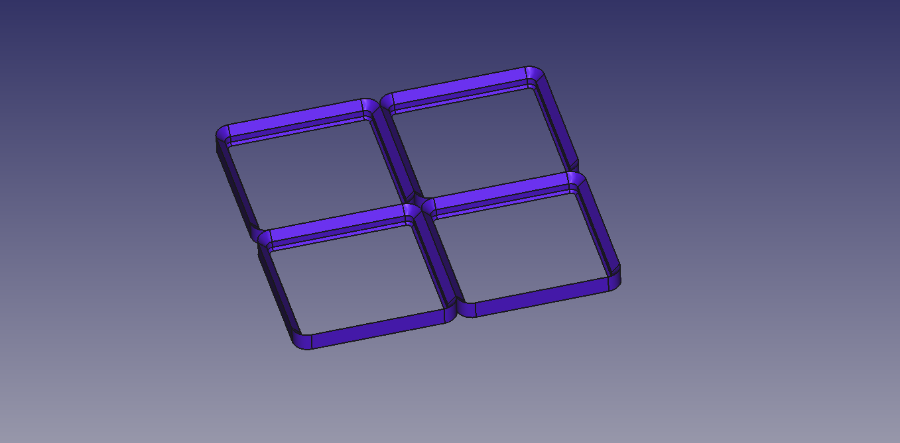
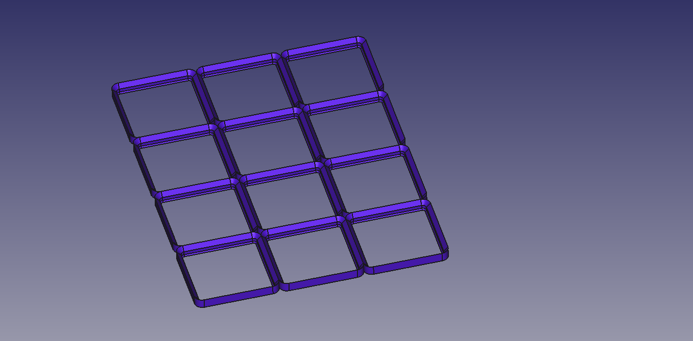
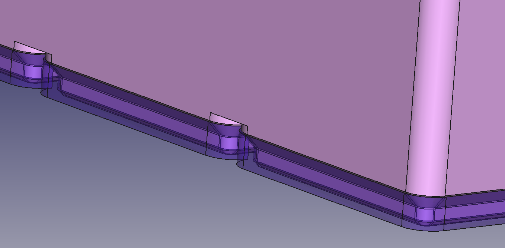
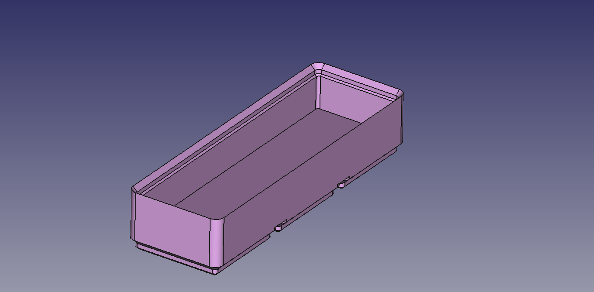
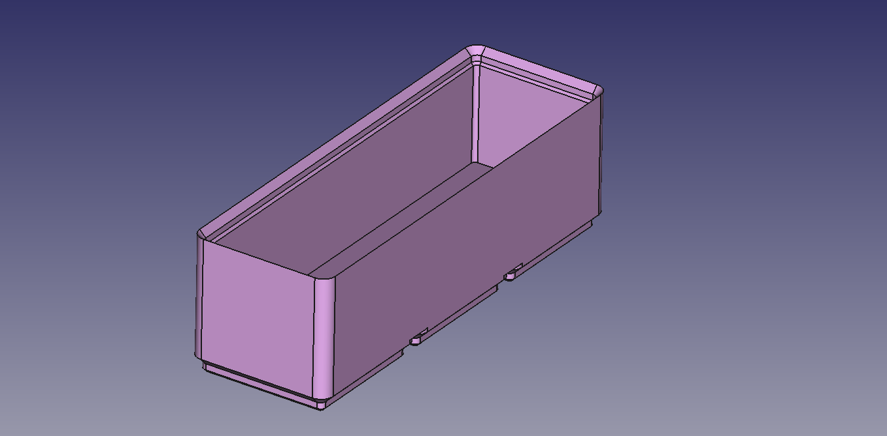
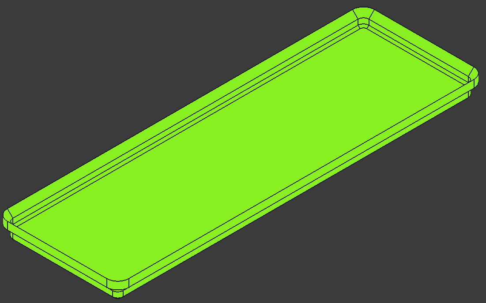
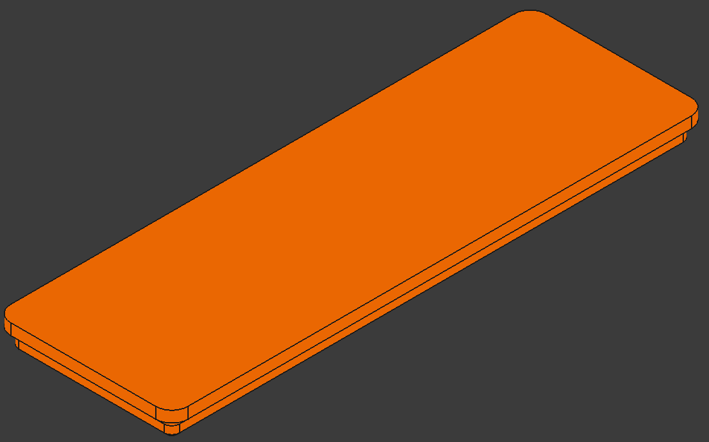
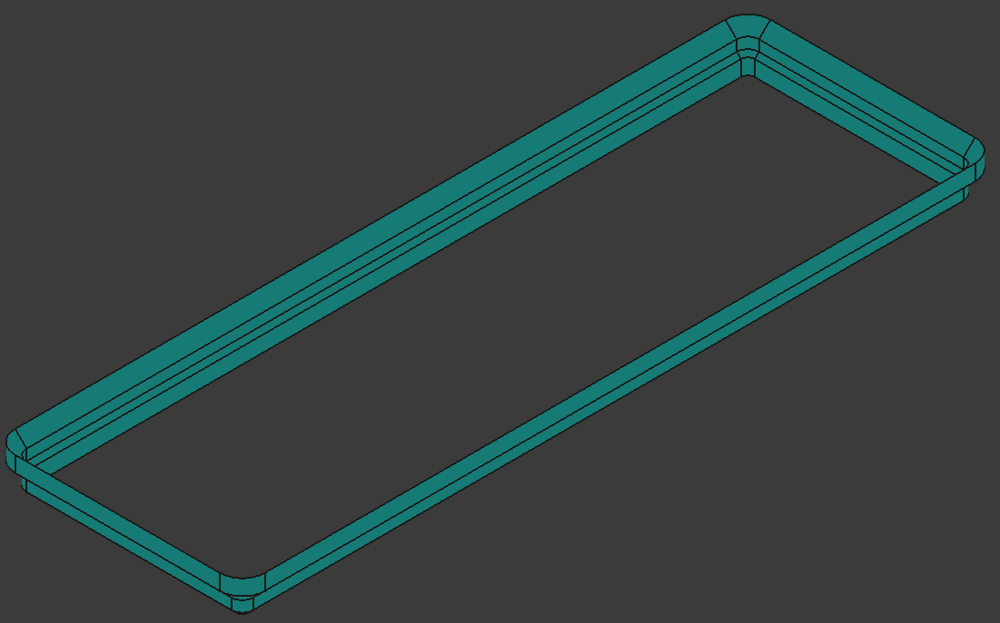

# dvng_gridfinity

Based on [Gridfinity | The modular, open-source grid storage system](https://www.youtube.com/watch?v=ra_9zU-mnl8), by [Zack Freedman's](https://www.youtube.com/@ZackFreedman). As it is an open design I belive it shall be possible to use only open tools for its development.

Check [the gridfinity official especification](https://gridfinity.xyz/specification/) to know more about the design. My implementation may not be strictly compliant with it, so be careful integrating it with your own or 3rd party designs, they may not work.

There is a single [FreeCAD file](./mec/gridfinity.FCStd) with all paramters, and bodies. There is one for the base plate that may be adjusted to any grid size. I decided to go with [FreeCAD](https://www.freecad.org/index.php) as I like it and it is pretty easy to use if you are familiar with other 3D parametric software. 

Within the single file there are multiple bodies, my idea is to have a body per design. The params variable set holds all the paremters of the design configuration. This set is hiden as it holds the parameters for its compliance with gridfinity design (modify on your own risk). The user_inputs variable set have 3 parameters to configure the size of configurable desings, not all of them are condigurable.

## Base plate
The joints between squares are not filled, the original design does not require it, and I think it is just a waste of material.

| 1x1 | 2x2 | 4x3 |
| - | - | - |
| |  | |

| container and baseplate assembly |
| - |
| |

## Hollow container

Its grid size is configured as for the base plate. In this a new height parameter is added to control how deep it shall be. The edge is gridfinity compatible allowing to stack or ad lids by default.

| 2u tall | 4u tall | 
| - | - | 
| |  |

## Lid & spacer

There are two type of lids, one that allows stacking another containter above and a flat one.

| stackable lid  | flat lid  | spacer |
| - | - | - | 
|  |  |  |

---
	
Future work:

1. Solid/custom container containers
	- Battery tray (AAA, AA 9V, CR2032 )
	- Jewelry ( rings, earpieces )
	- Cutlery
	- Screws and nuts
	- Various small tools
	- Electronics
	- Baseplate filler
2. Add sticker plates for all designs
3. Script to semi-automatically generate stl files ready to 3d print.

---

Davang -