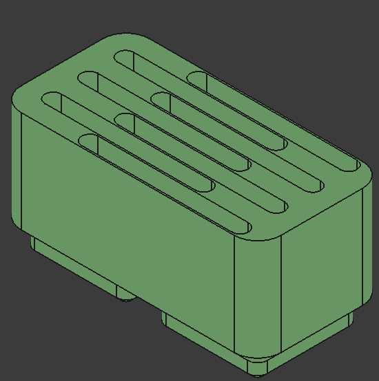
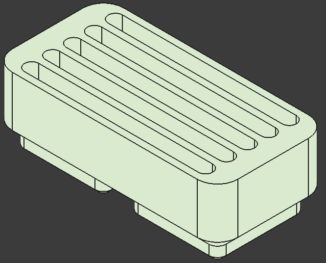
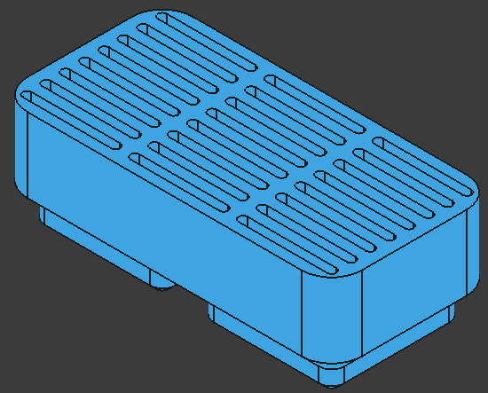
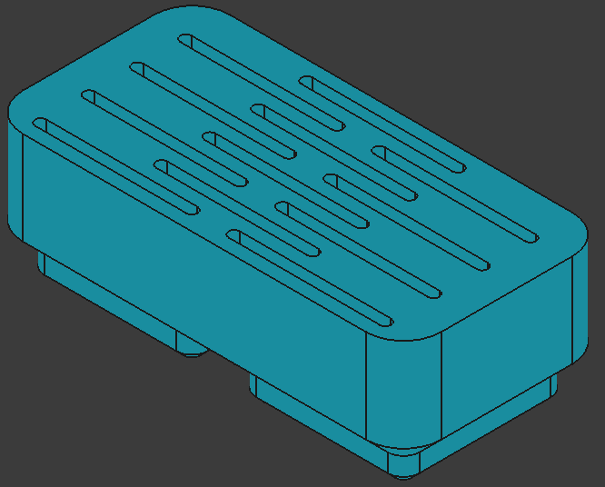
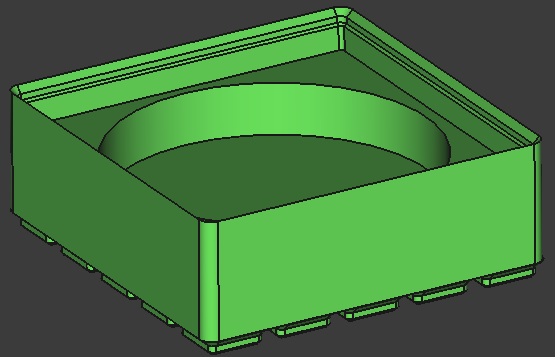
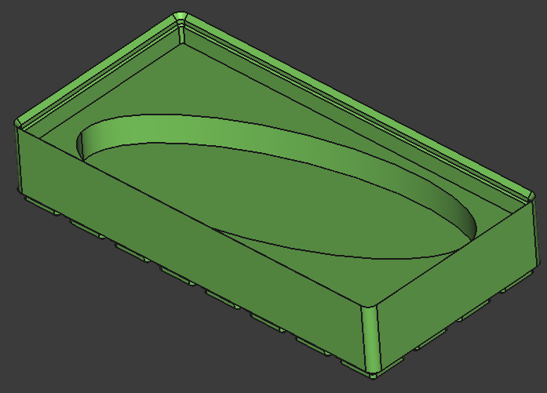

# dvng_gridfinity

Based on [Gridfinity | The modular, open-source grid storage system](https://www.youtube.com/watch?v=ra_9zU-mnl8), by [Zack Freedman's](https://www.youtube.com/@ZackFreedman).
As it is an open design I belive it shall be possible to use only open tools for its development.
Read [the gridfinity official especification](https://gridfinity.xyz/specification/) to know more about the design.
My implementation is not strictly compliant with it as it uses 21 mm as standard width instead of 42 mm.
But my designs shall be compatible with the original standard

All models are parametrizable through the `user_input` variable set.
The `parameters` variable set sanitzes the `user_input` values and defines all design parameters.
If a variable in the `parameters` set is changed it may be possible the design is broken.
Some manual adjustment may be reqruied.
Not all files have the same variables to configure.

One goal of this project is that all models can be easily configured for your own needs.
I do not seek to have a fully parametrizable project.
But one that is flexible enough to adapt up to certain level.

This project uses half size as default unit.
The baseplate unit size is divided by two, 21 mm.
And all other measuremets are reduced equally.
This means the container is 20.5 mm width.
The height unit is not affected

| parameter | value |
| - | - |
| base plate width | 21 mm |
| base plate outer radius | 4 mm |
| container width | 20.5 mm |
| container outher radius | 3.75 mm |
| unit height | 7 mm |

All models are within the [mec](./mec/) directory.
The [src](./src/) has a python script that launches a ncurses GUI con easily configure and generate .STEP files of each model.
run `make` to run the script automatically.

I decided to go with [FreeCAD](https://www.freecad.org/index.php) as I like it and it is pretty easy to use if you are familiar with other 3D parametric software.
Unlike OpenScad or other gridfinity generators the main target of this project is to have 3d models of the designs.
Although I apprecieate the work of the generators and those projects based on OpenScad, for me they feel like coding.
If I am doing 3d modeling, I do not want to write code.

## [Baseplate](./etc/baseplate/README.md)
| | | |
| - | - | - |
| 5x2 no filling corner | 4x3 filling corner | 3x3 single chamfer |
|  |  |  |
| 4x8 slanted | dual size grid | clipable |
|  | TBD | TBD |
| sliding | TBD | TBD |

## [Container](./etc/container/README.md)

| | | |
| - | - | - |
| 5x3x3 stackable | 2x2x10 non-stackable | 5x5x4 non-stackable |
|  |  |  |
| SD cards | micro SD cards | tall pen cup |
| vertical mount  horizontal mount   | vertical mount   horizontal mount   |   |
| clipable | slanted bin and lid | geomtric shapes |
| geometrics shapes 0 | geometrics shapes 1 | geometrics shapes 2 |
|   | regular triangle heptagon | rectangle rhombus |
| SDD/HDD | multibin | batteries |
| cutlery | cable organizer | sliding bin |
| vernier calliper | cable organizer | sliding bin |

## [Miscellaneous](./etc/misc/README.md)

| | | |
| - | - | - |	
| spacer 5x2x3 | lid 3x4 | lid stackable 7x3 |
|  |  |  |
| cable canal | phone holder/charger | cleat |
| gridfinity ruler | TBD | TBD |

---

## Bibliography
* [Gridfiniry sepcs](https://gridfinity.xyz/)
* [Clip-on Gridfinity Baseplate and Bin](https://www.printables.com/model/368313-clip-on-gridfinity-baseplate-and-bin)
* [Gridfinity Angled baseplates](https://www.printables.com/model/656549-gridfinity-angled-baseplates)
* [Gridfinity | Tiered Baseplate | Parametric](https://www.printables.com/model/554733-gridfinity-tiered-baseplate-parametric)
* [Polyonimo](https://en.wikipedia.org/wiki/Polyomino)
* [Gridfinity 2x1 Phone Stand](https://www.printables.com/model/468962-gridfinity-2x1-phone-stand)
* [Gridfinity Cable Organizing Boxes](https://makerworld.com/en/models/510993-gridfinity-cable-organizing-boxes?from=search#profileId-934624)
* [Gridfinity - Battery Holders](https://makerworld.com/en/models/552824-gridfinity-battery-holders?from=search#profileId-471382)
* [Gridfinity Desk Organizer System - Deskfinity](https://makerworld.com/en/models/826392-gridfinity-desk-organizer-system-deskfinity?from=search#profileId-780724)
* [Sliding Gridfinity baseplate](https://www.printables.com/model/1433851-sliding-gridfinity-baseplate)
* [Gridfinity Kitchen Drawer (Parametric)](https://makerworld.com/en/models/883766-gridfinity-kitchen-drawer-parametric?from=search#profileId-838429)
* [Gridfinity Sliding Lid Bin with Click Notch](https://www.printables.com/model/1041699-gridfinity-sliding-lid-bin-with-click-notch)
* [Gridfinity Ruler MKII [7 Unit Length]](https://makerworld.com/en/models/856330-gridfinity-ruler-mkii-7-unit-length?from=search#profileId-805694)
* [Gridfinity Height Ruler - Slim Edition](https://makerworld.com/en/models/208796-gridfinity-height-ruler-slim-edition?from=search#profileId-228778)

---

Davang -