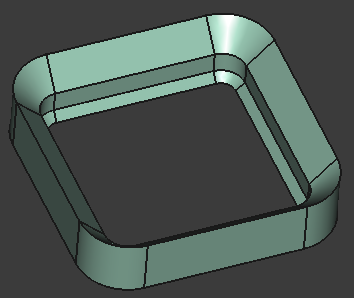
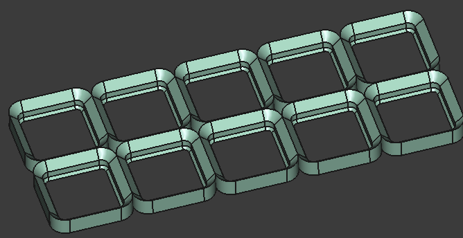
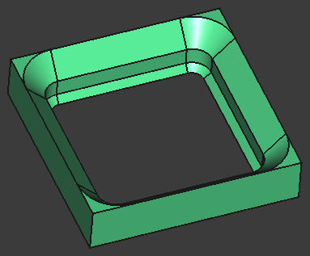
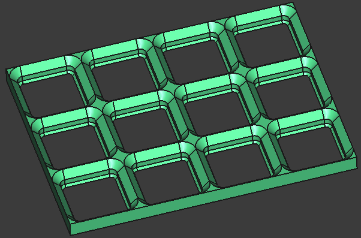
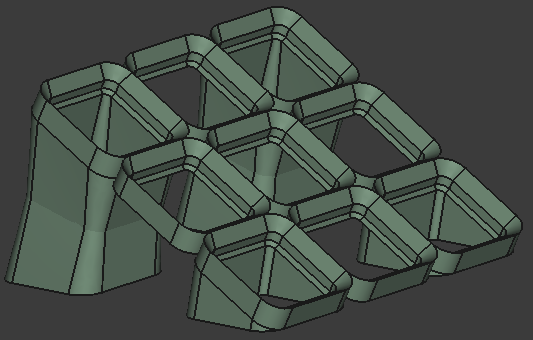
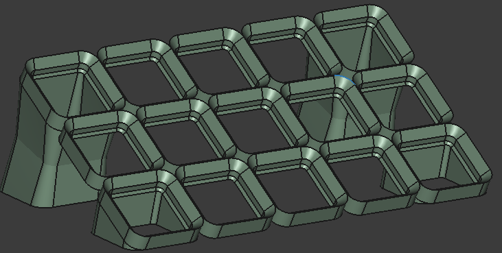

# dvng_gridfinity

Based on [Gridfinity | The modular, open-source grid storage system](https://www.youtube.com/watch?v=ra_9zU-mnl8), by [Zack Freedman's](https://www.youtube.com/@ZackFreedman). As it is an open design I belive it shall be possible to use only open tools for its development.

Check [the gridfinity official especification](https://gridfinity.xyz/specification/) to know more about the design. My implementation may not be strictly compliant with it, so be careful integrating it with your own or 3rd party designs, they may not work.

There is a bibliography at the botton with any model I used as inspiration.

## [Baseplate](./mec/baseplate.FCStd)

In addition to the classic baseplate there are custom vaiant baseplates. By default all baseplate do not have the corner filled.

All models are parametrizable through the `user_input` variable set. The grid size is controlled with the variables `grid_size.x_count` and `grid_size.y_count`.

### standard profile
There are two variants, one with and other without filled corners.

| 1x1 no filling corner | 5x2 no filling corner | 1x1 filling corner | 4x3 no filling corner |
| - | - | - | - |
| |  | |  |

### single chamfer
This profiles is like the original one but the chamfer in the bottom is removed.
This simplifies the geometry, reduces printing time and is backwards compatible with the original design.

| 1x1 corner | 4x3 no corner |
| - | - |
| |  |

### slanted
In this case the baseplate is rotated up to degrees.
There are four feet to support it.
Check the bins to found the one that may be used to make it gridfinit compatible.
The angle is controller with the variable `slanted.angle`

In ceratin cases there are only two feets.
I was only capable to do it with a minium size of 3x3 and a loft operation to conect o the base.
If you know to solve it or use a revolution operation please feel free to solve it.

| 3x3 corner | 5x3 no corner |
| - | - |
| |  |

### tiered
In this case the base plate is presented in a stair. It is possible to customize the size of each step.
Check the user input `tiered.step_height` to customizate it. The number of steps is controlled with `grid_size.y_count`

| 2x2 tiered | 6x4 tiered |
| - | - |
| |  |

### clipable
This baseplate has some slots that in combination with the clip-on container it makes possible to restrain them.
My design only counts with two holes.

| 1x1 clipable | 3x3 clipable |
| - | - |
| |  |

## Lid & Spacer
There are two main variants of the lid.
The space unlike the Lid may be configured for different heights with the variable `spacer.height`. It uses the same units as `container.height`

#### lid non-stackable

| .... | .... |
| - | - |
| |  |

### lid stackable

| .... | .... |
| - | - |
| |  |

### spacer

| .... | .... |
| - | - |
| |  |

## Container

| .... | .... |
| - | - |
| |  |

### hollow

| .... | .... |
| - | - |
| |  |

### cutout

| .... | .... |
| - | - |
| |  |

### slanted baseplate compatible

| .... | .... |
| - | - |
| |  |

### clickable

| .... | .... |
| - | - |
| |  |

### polyonimo

| .... | .... |
| - | - |
| |  |

---

## Bibliography
[Gridfiniry sepcs](https://gridfinity.xyz/)
[Clip-on Gridfinity Baseplate and Bin](https://www.printables.com/model/368313-clip-on-gridfinity-baseplate-and-bin)
[Gridfinity Angled baseplates](https://www.printables.com/model/656549-gridfinity-angled-baseplates)
[Gridfinity | Tiered Baseplate | Parametric](https://www.printables.com/model/554733-gridfinity-tiered-baseplate-parametric)
[Polyonimo](https://en.wikipedia.org/wiki/Polyomino)

---

Davang -